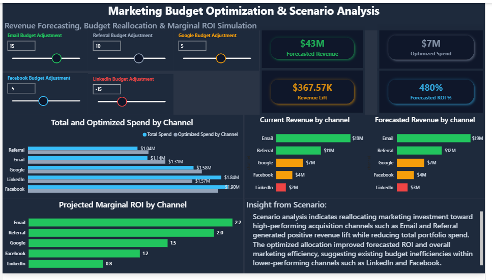
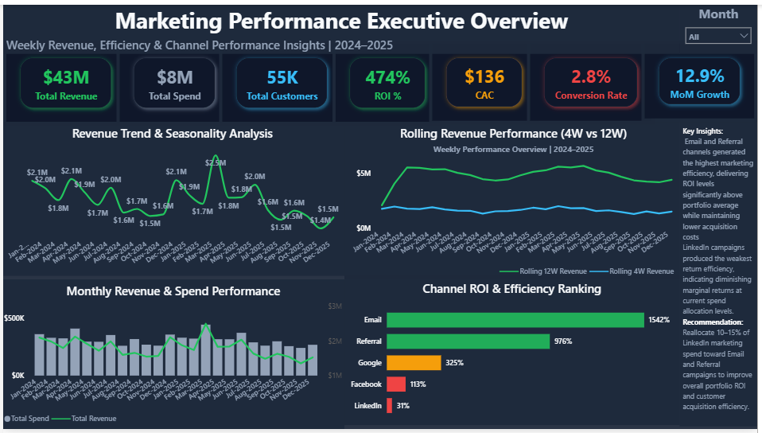
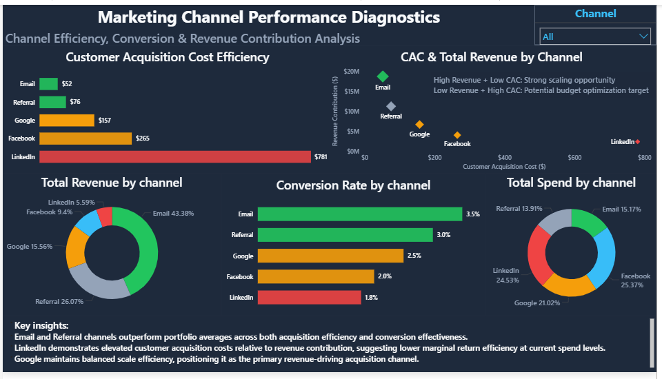
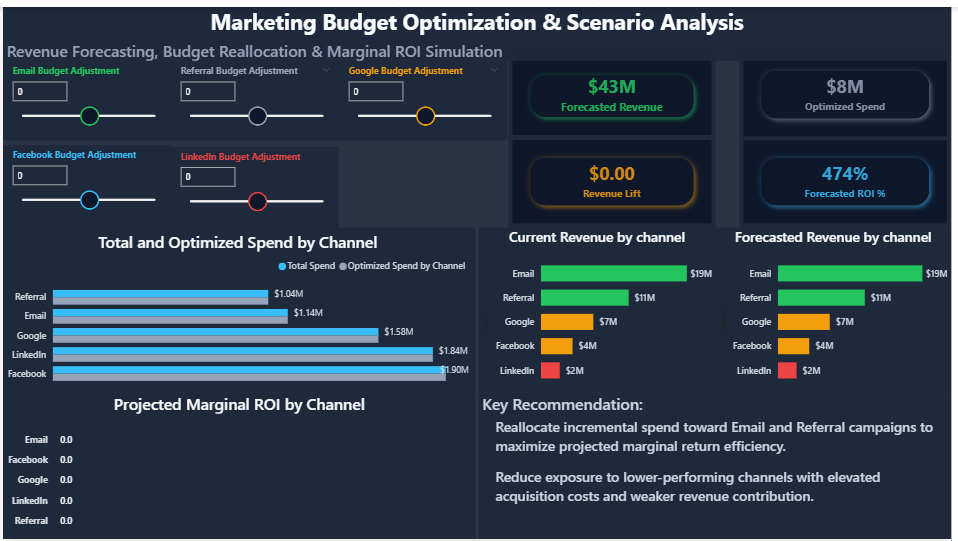

# 📊 Marketing Mix Modeling & Revenue Optimization System

### 📈 Scenario Induced Dashboard

## Executive Summary

This project analyzes marketing channel efficiency, customer acquisition costs, conversion performance, and ROI contribution across multiple acquisition channels using Marketing Mix Modeling (MMM) and scenario-based revenue forecasting.

The system combines:
- channel performance diagnostics
- budget optimization
- revenue forecasting
- marginal ROI simulation
- spend reallocation analysis

to support data-driven marketing investment decisions.

---

## Business Problem

Marketing teams often struggle to determine:
- which acquisition channels drive the highest ROI
- where marketing spend is inefficient
- how budget reallocations impact revenue
- which channels should be scaled or reduced

This project was designed to simulate marketing budget optimization scenarios and identify high-efficiency growth opportunities using data-driven analysis.

---

## 📊 Dashboard Walkthrough

### 📈 Executive Performance Overview

Tracks:
- Revenue trends
- Marketing ROI
- CAC performance
- Revenue seasonality
- Rolling revenue performance
- Channel efficiency ranking

Key objective:

Evaluate portfolio-level marketing efficiency and revenue performance trends.

---

### 🔍 Marketing Channel Performance Diagnostics

Analyzes:
- CAC efficiency
- Revenue contribution
- Conversion rates
- Spend allocation
- Channel-level ROI

Key objective:
Identify high-performing acquisition channels and inefficient spend areas.

---

### 🎯 Budget Optimization & Scenario Analysis

Simulates:
- spend reallocation strategies
- marginal ROI impact
- projected revenue lift
- optimized budget distribution

Key objective:
Support marketing investment decisions using scenario-based forecasting.

---

## 🖼️ Dashboard Preview

### 📊 Executive Overview

###   Channel Diagnostics

### 📈 Scenario Analysis

---

## 🧠 Analytical Framework

The project combines:
- Marketing Mix Modeling (MMM)
- Revenue forecasting
- Scenario analysis
- Marginal ROI simulation
- Customer acquisition cost analysis
- Channel efficiency diagnostics

to evaluate marketing investment performance and optimize revenue growth strategies.

---

## 🗂️ Data Structure

### Fact Table — marketing_performance

The primary dataset contains:

| Field | Description |
|---|---|
| date | Transaction/reporting date |
| channel | Marketing acquisition channel |
| spend | Marketing spend |
| revenue | Revenue generated |
| customers | Acquired customers |
| impressions | Campaign impressions |
| clicks | Campaign clicks |
| leads | Generated leads |
| conversion_rate | Channel conversion rate |
| cac | Customer acquisition cost |
| campaign_type | Campaign classification |
| device | Device segmentation |

---

## 📐 Data Model

The dashboard follows a star-schema-inspired analytical model.

### 🧩 Tables Included

| Table | Purpose |
|---|---|
| marketing_performance | Primary fact table |
| Calendar | Time intelligence dimension |
| Measure | Centralized DAX measure table |
| Parameter Tables | What-if scenario modeling |

### 🔁 Time Intelligence Features

The Calendar table supports:

- Year-Month analysis
- Quarterly analysis
- Weekly reporting
- Rolling calculations
- MoM calculations
- WoW calculations
- PM calculations

---

## 📊 Core Metrics

- Customer Acquisition Cost (CAC)
- Marketing ROI
- Conversion Rate
- Revenue Contribution
- Marginal ROI
- Revenue Lift
- Optimized Spend Allocation
- Revenue Forecasting
- Monthly Growth Rate

---

## 🧰 Tools & Technologies

- Power BI
- Power Query
- DAX
- Python
- Scenario Modeling
- Marketing Mix Modeling Concepts
- Time Intelligence
- Data Visualization
- KPI Analytics
- Executive Dashboard Design
- Gen AI - Dataset generator

---

## 🔍 Key Insights

### 📈 1. Email Delivers Highest ROI Efficiency
Email generated the strongest ROI and lowest CAC across all acquisition channels, making it the most scalable revenue driver.

### 💰 2. LinkedIn Spend Is Operationally Inefficient
LinkedIn demonstrated the highest customer acquisition cost with weak revenue contribution and lower conversion efficiency, reducing marginal return effectiveness.

### 🎯 3. Referral Campaigns Show Strong Revenue Efficiency
Referral channels consistently maintained strong ROI performance while requiring lower relative spend allocation.

### ⚠️ 4. Budget Allocation Is Not Optimized
Current spend distribution over-invests in lower-performing channels while underfunding high-efficiency channels.

### 📊 5. Scenario Modeling Improves Revenue Forecasting
Budget reallocation simulations projected improved ROI performance and incremental revenue lift through optimized channel investment strategies.

---

## 💼 Business Impact

This system enables:
- smarter marketing budget allocation
- improved ROI forecasting
- identification of inefficient acquisition spend
- optimization of customer acquisition efficiency
- data-driven GTM investment decisions
- executive-level marketing performance visibility

---

## Recommendations

### 🚀 Strategic Recommendations

1. Reallocate incremental budget toward Email and Referral campaigns to maximize projected ROI efficiency.

2. Reduce investment exposure to underperforming channels with elevated CAC and weaker marginal returns.

3. Continuously monitor channel-level conversion efficiency and marginal ROI performance before scaling spend.

4. Combine revenue forecasting with scenario analysis to improve long-term marketing investment planning.

5. Use cohort and lifecycle analysis alongside MMM to improve attribution and retention visibility.

---

## Future Enhancements

Potential future improvements include:

- Econometric marketing mix modeling
- Machine learning forecasting
- Campaign-level attribution modeling
- Predictive customer lifetime value analysis
- Automated optimization engines
- AI-assisted budget allocation recommendations
- Real-time data integration

---

## 🧾 Final Takeaway

Marketing performance should not be evaluated solely on spend volume or top-line revenue.

Sustainable growth depends on:
- acquisition efficiency
- marginal ROI performance
- conversion quality
- optimized budget allocation
- data-driven forecasting

This project demonstrates how marketing analytics can support smarter revenue investment decisions through integrated business intelligence and scenario-based optimization.

---

## 👤 Author

**Abodunrin (Richard) Oketade**  

Data Analytics | Business Intelligence | Marketing Analytics | Power BI | SQL | Python

> “Turning data into business decisions.” 

---

